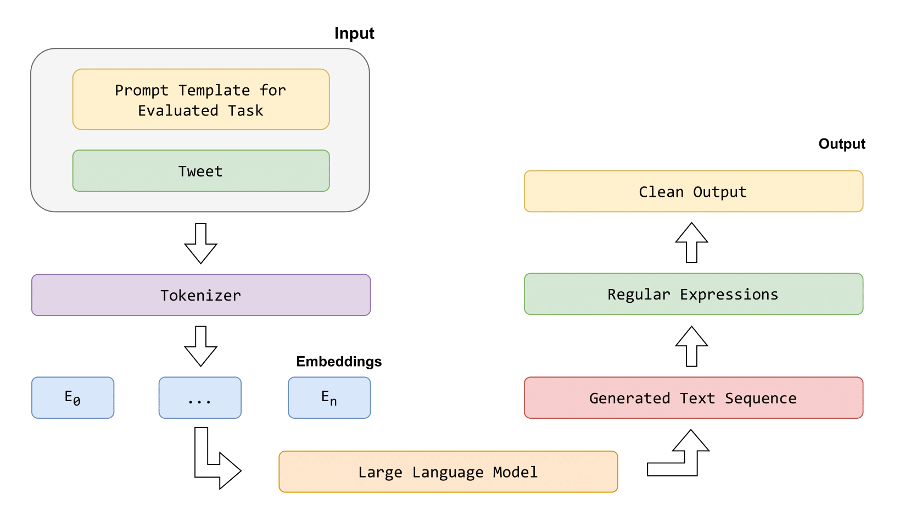

# Spanish-HateSpeech-ICL-Evaluation
## Detection of Maliciously Disseminated Hate Speech in Spanish Using Fine-Tuning and In-Context Learning Techniques with Large Language Models  
*(Accepted in CMC — Computers, Materials & Continua, 2025)*

### TL-DR: Highlights
- This repository provides the **implementation and experimental framework** from the paper.
- The study is conducted **on top of the [Spanish-MTLHateCorpus 2023](https://github.com/NLP-UMUTeam/Spanish-MTLHateCorpus)** dataset:
- We evaluate the detection of **maliciously disseminated hate speech**, a challenging subtype requiring more complex semantic and pragmatic reasoning.
- Comprehensive comparison between:
  - **Fine-tuning** approach.
  - **In-Context Learning (ICL)** with instruction-based prompting, concretelly Zero-Shot and Few-Shot Learning.
- The paper demonstrates that ICL can approach fine-tuning performance in certain subtasks, while offering practical advantages for rapid prototyping and low-resource scenarios.

### Authors

- **Tomás Bernal-Beltrán** — University of Murcia  
  [Google Scholar](https://scholar.google.com/citations?user=0bTUxQEAAAAJ&hl=en) · [ORCID](https://orcid.org/0009-0006-6971-1435)

- **Ronghao Pan** — University of Murcia  
  [Google Scholar](https://scholar.google.com/citations?user=80lntLMAAAAJ) · [ORCID](https://orcid.org/0009-0008-7317-7145)

- **José Antonio García-Díaz** — University of Murcia  
  [Google Scholar](https://scholar.google.com/citations?user=ek7NIYUAAAAJ) · [ORCID](https://orcid.org/0000-0002-3651-2660)

- **María del Pilar Salas-Zárate** — Tecnológico Nacional de México / ITS Teziutlán  
  [Google Scholar](https://scholar.google.com/citations?user=2ssaDdsAAAAJ&hl=en) · [ORCID](https://orcid.org/0000-0003-1818-3434)

- **Mario Andrés Paredes-Valverde** — Tecnológico Nacional de México / ITS Teziutlán  
  [Google Scholar](https://scholar.google.com/citations?user=AYJZ7cEAAAAJ&hl=en) · [ORCID](https://orcid.org/0000-0001-9508-9818)

- **Rafael Valencia-García** — University of Murcia  
  [Google Scholar](https://scholar.google.com/citations?user=GLpBPNMAAAAJ) · [ORCID](https://orcid.org/0000-0003-2457-1791)  

> **Affiliations:**  
> \* *Departamento de Informática y Sistemas, Universidad de Murcia, Campus de Espinardo, Murcia, Spain*
> \* *Tecnológico Nacional de México / ITS Teziutlán, Puebla, Mexico*


### Publication
This work has been accepted for publication in **CMC - Computers, Materials & Continua (2025)**.  
More information (DOI, volume, issue) will be added upon release. 

---

### Abstract
The malicious dissemination of hate speech via compromised accounts, automated bot networks, and malware-driven social media campaigns has become a growing cybersecurity concern. Automatically detecting such content in Spanish is challenging due to linguistic complexity and the scarcity of annotated resources. 

In this paper, we compare two predominant AI-based approaches for the forensic detection of malicious hate speech:  
(1) **fine-tuning encoder-only Spanish LLMs**, and  
(2) **In-Context Learning (ICL)** techniques (Zero- and Few-Shot Learning) with large-scale language models.

Our approach goes beyond binary classification, proposing a comprehensive multidimensional evaluation that labels each text according to:  
1. **Type of speech**,  
2. **Recipient**,  
3. **Level of intensity** (ordinal), and  
4. **Targeted group** (multi-label).

Performance is evaluated using an annotated Spanish corpus and standard metrics as well as stability-oriented metrics to quantify the transition from Zero-Shot to Few-Shot prompting, namely **Zero-to-Few Shot Retention** and **Zero-to-Few Shot Gain**.

Results show that fine-tuned encoder-only models consistently achieve the strongest and most reliable performance, with macro F1-scores roughly in the **46–66%** range depending on the task. Zero-Shot prompting is considerably less stable and typically obtain substantially lower performance (F1-scores in the range **0–39%**), often producing invalid outputs. Few-Shot prompting (e.g., Qwen 3 8B, Mistral 7B) improves stability and recall relative to Zero-Shot, reaching F1-scores in the range **20–51%**, but still falls short of fully fine-tuned models.

These findings highlight the importance of supervised adaptation and discuss the potential of both paradigms as components in AI-powered cybersecurity and malware forensic systems aimed at identifying and mitigating coordinated online hate campaigns.

### Evaluation
The following figure illustrates the ICL inference pipeline used in our experiments. A prompt template specific for each task is combined with the input tweet and passed through the tokenizer, which produces a sequence of embeddings. These embeddings are fed into the LLM, which generates a textual response. Because raw model outputs may contain additional formatting or irrelevant information, a post-processing step based on regular expressions is applied to extract the final clean label. The resulting output is then used for evaluation.

<p align="center">
  
</p>

The table below summarizes the variability of macro-F1 scores across models for each task and learning paradigm, together with the ranges of the stability-related metrics (PVR, ZFR, ZFG) for Few-Shot Learning (FSL).

| Task             | FT F1 range (%) | ZSL F1 range (%) | FSL F1 range (%) | FSL PVR range (%) | FSL ZFR range (%) | FSL ZFG range (%) |
|------------------|----------------:|-----------------:|-----------------:|------------------:|------------------:|------------------:|
| Type of speech   | 53.2–59.9       | 00.1–38.7        | 00.0–43.4        | 00.0–100.0        | 00.0–70.4         | 00.0–34.6         |
| Recipient        | 64.3–67.8       | 09.6–47.5        | 00.0–51.8        | 00.0–100.0        | 00.0–86.4         | 00.0–50.5         |
| Intensity        | 43.5–48.1       | 00.2–25.6        | 00.0–22.8        | 01.0–100.0        | 00.0–70.4         | 00.0–34.6         |
| Targeted group   | 57.7–65.7       | 07.0–34.5        | 00.0–40.1        | 00.0–100.0        | 00.0–68.1         | 00.0–26.8         |


The results show that **fine-tuned encoder-only models** exhibit relatively narrow and consistently strong macro-F1 ranges across tasks (typically between ~44–68%), whereas **models evaluated under the ICL approaches** display much higher variability. In several cases, ZSL and FSL models range from almost 0% up to moderate F1 scores, illustrating that their performance is highly sensitive to the choice of model and prompting configuration.

In addition to classical metrics (accuracy, precision, recall, F1), we also evaluate **stability-oriented metrics** for the ICL approaches:

- **PVR (Prediction Validity Rate)** – proportion of model outputs that are valid according to the task schema.  
- **ZFR (Zero-to-Few Shot Retention)** – percentage of correctly classified instances in ZSL that remain correctly classified in FSL.  
- **ZFG (Zero-to-Few Shot Gain)** – percentage of missclasified instances under ZSL that become correctly classified when moving to FSL.

The wide ranges observed for PVR, ZFR, and ZFG confirm that ICL-based approaches are not only more volatile in terms of F1, but also in terms of output validity and stability when transitioning from Zero-Shot to Few-Shot prompting.


### Acknowledgments
This work is part of the research project **LaTe4PoliticES (PID2022-138099OB-I00)** funded by *MCIN/AEI/10.13039/501100011033* and the *European Fund for Regional Development (ERDF)-a way to make Europe*. Mr. Tomás Bernal-Beltrán is supported by **University of Murcia** through the *predoctoral programme*.


### Citation
A complete BibTeX citation will be added when the DOI is assigned.

```
@article{bernal2025malicioushatespeech,
  title={Detection of Maliciously Disseminated Hate Speech in Spanish Using Fine-Tuning and In-Context Learning Techniques with Large Language Models},
  author={Bernal-Beltr{\'a}n, Tom{\'a}s and Pan, Ronghao and Garc{\'\i}a-D{\'\i}az, Jos{\'e} Antonio and Salas-Z{\'a}rate, Mar{\'\i}a del Pilar and Paredes-Valverde, Mario Andr{\'e}s and Valencia-Garc{\'\i}a, Rafael},
  journal={CMC -- Computers, Materials \& Continua},
  year={2025},
  note={Accepted}
}
```

### Experiments code

This repository contains several Python scripts implementing the experimental setups described in the paper, covering Fine-Tuning and ICL approaches (ZSL and FSL). Additionally, a prompts directory stores the prompt templates used for each task and learning paradigm.

#### Python Scripts

- **ft_sa.py**: Implements the fine-tuning pipeline for encoder-only Spanish language models. This script:
  - Loads the Spanish-MTLHateCorpus dataset.
  - Preprocesses and tokenizes the data.
  - Fine-tunes a selected encoder-only model for each task.
  - Evaluates performance using standard classification metrics (accuracy, precision, recall, macro-F1).

- **zs_sa.py**: Implements the ZSL setup using instruction-based prompting. This script:
  - Loads the evaluation split of the Spanish-MTLHateCorpus dataset,
  - Applies task-specific Zero-Shot prompts.
  - Generates predictions using a large language model.
  - Post-processes raw textual outputs using regular expressions to extract valid labels.
  - Computes both classical metrics and validity-related statistics.

- **fs_sa.py**: Implements the FSL setup using instruction-based prompting. This script:
  - Extends the Zero-Shot pipeline by injecting a small number of in-context examples into the prompt.
  - Evaluates the impact of Few-Shot prompting on performance and stability.

#### Prompts Folder

Contains all prompt templates used in the experiments, organized by:
  - Task (type of speech, recipient, intensity, targeted group),
  - Learning paradigm (Zero- and Few-Shot).

#### Installation and Usage

The experiments were developed and tested using **Python 3.10.16**.  
It is recommended to use a virtual environment to avoid dependency conflicts.

1. Clone the repository
```
git clone https://github.com/NLP-UMUTeam/Spanish-HateSpeech-ICL-Evaluation
cd Spanish-HateSpeech-ICL-Evaluation
```

2. Create and activate a virtual environment (recommended)
```
python -m venv venv
source venv/bin/activate   # Linux / macOS
venv\Scripts\activate      # Windows
```

3. Install dependencies
```
pip install -r requirements.txt
```

4. Execute experiments

First, you must obtain access to the [Spanish-MTLHateCorpus 2023](https://github.com/NLP-UMUTeam/Spanish-MTLHateCorpus) dataset:
Once downloaded, update the dataset path by modifying the global dataset directory variable defined at the top of each script (ft_sa.py, zs_sa.py, and fs_sa.py) so that it points to the local dataset location.

- Fine-Tuning experiments

```
python ft_sa.py -m MODEL_TO_EVALUATE -t TASK_TO_EVALUATE
```

This script performs supervised fine-tuning of encoder-only Spanish language models and evaluates them on the corresponding task-specific splits.

- ZSL experiments

```
python zs_sa.py -m MODEL_TO_EVALUATE
```

This script evaluates large language models using instruction-based Zero-Shot prompting, applying task-specific prompts and post-processing the generated outputs.

- FSL experiments

```
python fs_sa.py -m MODEL_TO_EVALUATE
```

This script extends the Zero-Shot setup by injecting a small number of in-context examples into the prompt, enabling Few-Shot Learning and computing both performance and stability-oriented metrics.